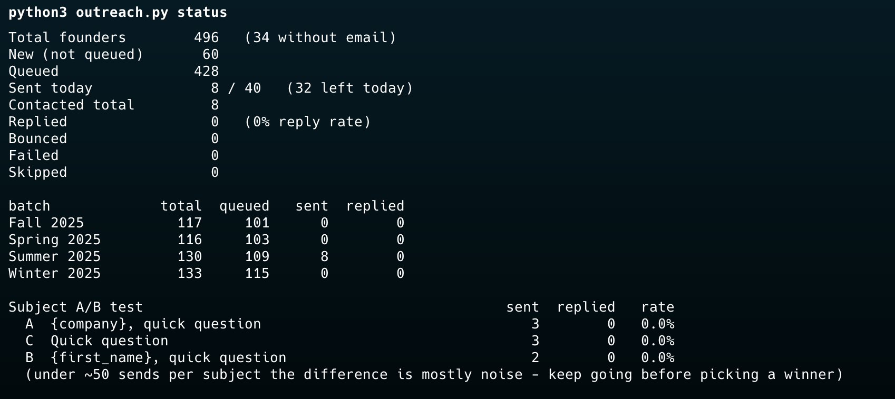

# YC Founder Outreach

A command-line tool for emailing Y Combinator founders about jobs, sent from your own Gmail.

Built for my own job search. Open-sourced in case it's useful to other engineers looking for startup roles.

Pick a YC batch (or a whole year), and it:

1. Pulls every company and founder from YC's public directory.
2. Finds each founder's email from public sources, then by guessing common patterns and checking them over SMTP.
3. Sends your template to each founder through Gmail, slowly, up to a daily limit.
4. Tracks queued, sent, replied and bounced in Postgres, and can A/B test subject lines.



---

## Requirements

- **Python 3.10+**
- **PostgreSQL** running locally (or any Postgres you can reach with a URL)
- **A Gmail account** with 2-Step Verification turned on, so you can create an App Password
- **Outbound port 25** for the SMTP email check. Most home connections allow it, but many cloud servers block it. Without it, the tool still works, but guessed emails come out as low confidence.

## Setup

```bash
git clone <this repo> && cd outreach

# 1. Python deps
python3 -m venv .venv
.venv/bin/pip install -r requirements.txt

# 2. Postgres database
brew install postgresql@18 && brew services start postgresql@18   # macOS, skip if you have Postgres
createdb outreach                     # or: createdb -U postgres outreach

# 3. Config
cp .env.example .env                  # then edit .env (see below)
cp template.example.txt template.txt  # then write your email
```

You don't need to activate the venv. `python3 outreach.py` switches to `.venv` on its own.

### `.env`

| Key                       | What it is                                                                                                                                                      |
| ------------------------- | --------------------------------------------------------------------------------------------------------------------------------------------------------------- |
| `GMAIL_ADDRESS`           | The Gmail address you send from                                                                                                                                 |
| `GMAIL_APP_PASSWORD`      | A 16-character App Password from <https://myaccount.google.com/apppasswords> (needs 2-Step Verification). Use this, **not** your normal password.               |
| `FROM_NAME`               | The name founders see in their inbox                                                                                                                            |
| `DATABASE_URL`            | Postgres URL, e.g. `postgresql://postgres@127.0.0.1/outreach`. Use a plain URL: if you copy one from a GUI app like TablePlus, delete everything after the `?`. |
| `DAILY_LIMIT`             | Most emails to send per day (default 40)                                                                                                                        |
| `MIN_DELAY` / `MAX_DELAY` | Random gap between emails, in seconds (default 60–180)                                                                                                          |

---

## Usage

```bash
# 1. Find founders and their emails (one batch, or a whole year)
python3 outreach.py find --batch "Summer 2025" --hiring-only
python3 outreach.py find --batch 2025 --hiring-only      # Winter + Spring + Summer + Fall 2025

# 2. Queue the founders whose email is likely right (high and medium confidence)
python3 outreach.py queue

# 3. Check the emails
python3 outreach.py preview          # print them in the terminal
python3 outreach.py test             # send yourself one copy per subject line

# 4. Send (throttled, stops at the daily limit; Ctrl+C is safe)
python3 outreach.py send --limit 5   # start small
python3 outreach.py send

# 5. Track results
python3 outreach.py replies          # check your inbox and mark replies and bounces
python3 outreach.py status           # overall totals plus the A/B results
```

Run `send` and `replies` once a day until the queue is empty.

### All commands

| Command                                                             | Does                                                                                                    |
| ------------------------------------------------------------------- | ------------------------------------------------------------------------------------------------------- |
| `find --batch B [--hiring-only] [--limit N] [--github] [--no-smtp]` | Finds founders and emails and saves them to the database. `B` is `"Summer 2025"` or a year like `2025`. |
| `import file.csv`                                                   | Loads a CSV produced by `find_emails.py`                                                                |
| `queue [--batch B] [--company C] [--confidence high,medium]`        | Marks founders as ready to send                                                                         |
| `unqueue [--batch B] [--company C]`                                 | Takes founders back out of the queue                                                                    |
| `skip EMAIL ...`                                                    | Never emails these addresses                                                                            |
| `preview [--n 3]`                                                   | Prints the rendered email for the next queued founders                                                  |
| `test`                                                              | Sends the rendered email to yourself, one copy per subject line                                         |
| `send [--limit N] [--dry-run]`                                      | Sends queued emails. `--dry-run` only lists who would get one.                                          |
| `replies`                                                           | Checks your Gmail inbox for replies and bounces                                                         |
| `status`                                                            | Shows totals, a per-batch breakdown and the A/B results                                                 |
| `ab`                                                                | Shows only the A/B results                                                                              |
| `list [--status S] [--batch B] [--confidence C]`                    | Lists founders. Statuses: `new`, `queued`, `sent`, `replied`, `bounced`, `failed`, `skipped`.           |

---

## The template

`template.txt` has one or more `Subject:` lines, then a blank line, then the body:

```
Subject: {company}, quick question
Subject: {first_name}, quick question

Hi {first_name},

I came across {company} and liked what you're building around {one_liner}...

Best,
[Your Name](https://www.linkedin.com/in/your-handle)
```

- **Placeholders:** `{first_name}` `{founder}` `{company}` `{one_liner}` `{batch}` `{title}` `{website}`
- **Links:** `[text](https://url)` becomes a clickable link. People whose email app shows only plain text see `text (url)`.
- **A/B testing:** write 2–3 `Subject:` lines. Emails are split evenly between them, and `status` shows the reply rate for each. You need about 50 sends per subject before the difference means much.

---

## How emails are found

YC's directory lists founder names but not their emails. For each founder, the tool tries:

1. **Public sources:** emails on the company website (homepage, `/about`, `/team`, `/contact`). With `--github`, it also checks the author email on the founder's public GitHub commits.
2. **Pattern guess plus SMTP check:** it tries `first@`, `first.last@`, `flast@` and so on, and asks the company's mail server whether each address exists. No email is sent. If a real address was found in step 1, that company's pattern is tried first.
3. **Catch-all domains:** some servers accept every address, so nothing can be confirmed. For these it guesses `first@domain`, the most common pattern at early-stage startups.

Each email gets a confidence level:

| Confidence | Meaning                                                                                     |
| ---------- | ------------------------------------------------------------------------------------------- |
| `high`     | Found publicly, or confirmed by the mail server                                             |
| `medium`   | A pattern guess on a catch-all domain (usually right)                                       |
| `low`      | Could not be checked                                                                        |
| `none`     | Nothing found. Try LinkedIn or [Work at a Startup](https://www.workatastartup.com) instead. |

`queue` only picks `high` and `medium` by default. On a sample of 20 Summer 2025 companies, about 85% of founders came out high or medium.

`find_emails.py` also works on its own and writes a CSV instead of using the database:

```bash
python3 find_emails.py --batch "Summer 2025" --hiring-only --out s25.csv
```

---

## Sending responsibly

This tool sends from **your** Gmail account, so your account's reputation is what's at stake.

- **Keep volume low.** A regular Gmail account allows about 500 emails a day, but sending that much cold email gets accounts flagged. The default of 40 a day with random gaps is deliberately slow.
- **Keep bounces low.** Only send to high and medium confidence emails, and run `replies` so bounced addresses are recorded.
- **Personalize.** Identical emails get ignored or end up in spam. Write something specific about each company.
- **Respect "no".** If someone asks you to stop, `skip` their address.
- Make sure your outreach follows the laws that apply to you, such as CAN-SPAM and GDPR, and the terms of YC and Gmail. This tool only reads YC's public directory, and doesn't log in to Bookface or Work at a Startup.

---

## Troubleshooting

| Problem                       | Fix                                                                                              |
| ----------------------------- | ------------------------------------------------------------------------------------------------ |
| `No module named 'psycopg'`   | Run `python3 -m venv .venv && .venv/bin/pip install -r requirements.txt`                         |
| `role "<you>" does not exist` | Use `postgresql://postgres@127.0.0.1/outreach` as `DATABASE_URL`, or create a role for your user |
| `invalid URI query parameter` | Your `DATABASE_URL` has extra settings after `?`. Delete them.                                   |
| Every email comes out `low`   | Port 25 is probably blocked. Run from a home connection, or accept low-confidence guesses.       |
| `Gmail login failed`          | You need an **App Password**, not your account password, and 2-Step Verification must be on.     |
| `Missing template.txt`        | Run `cp template.example.txt template.txt`                                                       |

## Files

```
outreach.py            main CLI (find, queue, send, track)
find_emails.py         email finder (also works on its own, writes a CSV)
template.example.txt   example email; copy it to template.txt
.env.example           example config; copy it to .env
requirements.txt
```

## Limitations

This is a small personal tool, not a production-grade platform.

- **Email finding is best-effort.** Without outbound port 25 (blocked on most cloud servers), emails can't be verified and come out low confidence. On catch-all domains, emails are educated guesses.
- **Gmail only.** It sends through Gmail SMTP and reads replies over IMAP. Other providers aren't supported.
- **Low volume by design.** It's built for tens of emails a day, not thousands. Gmail limits and your sender reputation cap how far it scales.
- **YC only.** It reads YC's public directory, so it depends on that site's structure and may break if it changes.

## License

[MIT](LICENSE) © Lakshay Maini
